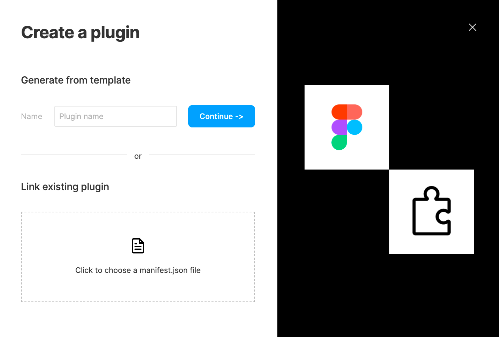
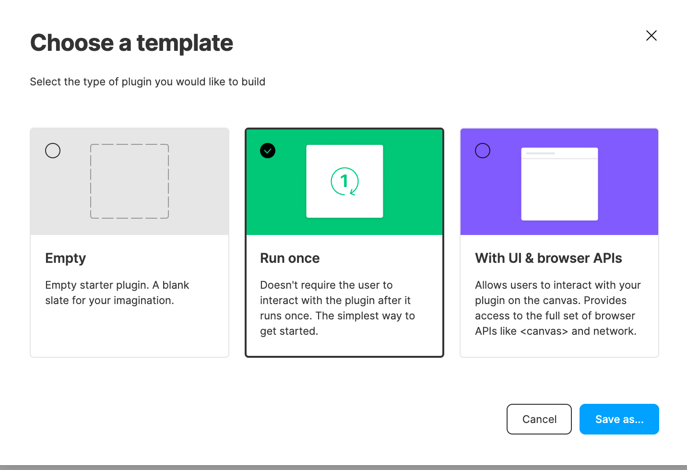
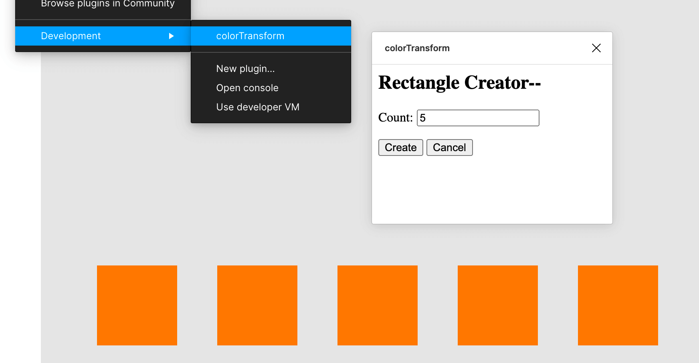

# 如何写figma插件——从零开始
近期要开展design to code项目，部门的设计师们大都使用figma，因而了解如何从零开始创建发布figma插件。

Figma插件主要是通过Javascript+HTML+CSS实现，比较适宜前端开发人员上手。

## 前期准备
**基础环境**：VsCode、NodeJS、NPM、TypeScript（若未安装，可参考文末的相关链接）。

官方推荐使用TypeScript开发，若无该依赖需要全局安装`npm install -g typescript`。
**Figma相关**
下载客户端并登陆（若无账号需注册）。
## 创建插件流程
### 1.新建插件
在Figma客户端里，打开一个已存在文件或者新建文件，依照路径Menu > Plugins > Development > New Plugin...，弹出下方的「创建插件」，可填写插件名称后选择新建插件或者打开已有插件。


【选择模板】新建插件后弹出选择何种插件模板，推荐选择「With UI & browser APIs」，后续将代插件代码文件夹保存在电脑磁盘中（代码内容为示例插件，创建指定数目的矩形）。

使用VsCode大家插件代码文件夹，具体目录结构如下所示
```
code.js			// 代码主文件，TS编译成JS
code.ts			// 代码主文件，后续会被编译为code.js
manifest.json	  // figma插件清单，包含基础信息与文件引用
package.json
READNE.md
tsconfig.json	  // TS配置文件，用于构建TS
ui.html			// UI界面

```
【安装依赖】
``` shell
npm install --save-dev @figma/plugin-typings
```
【设置TS编译】
在VsCode中，组合键[⌘⇧B]（Windows组合键为Ctrl+Shift+B），然后选择`tsc: watch - tsconfig.json`，此时会在终端实时编译TS代码。

### 2.预览插件
直接预览示例插件内容，在Figma客户端中，依照路径Menu > Plugins > Development > “你的插件代码名称”，预览示例插件，点击即可创建5个橙色矩形。

###3.发布示例插件
按照路径Menu > Plugins > Manage Plugin...，进入插件管理页面，如下图所示，点击「Publish New Release」，将弹出发布插件面板，填写相关信息即可点击发布到社区。

**发布信息**
icon：建议128 x 128；
插件描述：支持富文本编辑；
插件封面图：建议1920 x 960，安全区尺寸为1600 x 960；
发布对象：整个Figma社区or个人组织。
其余更多介绍参见下方参考链接“Publish plugins to the Figma Community”。

✅至此一个Figma示例插件创建发布完成。

## 其他
### 插件原理
Figma采用将插件代码在sandbox的主线程上运行的执行模式。这个sandbox是最小的JS环境，营造了支持ES6的环境。对于最低版本仍有控制台API。但是无法从sandbox中直接获得XMLHttpRequest 和DOM等浏览器原生API。

可以通过创建一个`<iframe>`的方式使用浏览器API（如显示UI或访问网络等），里面包含`<script>`标签。


### 调试
在Figma客户端中，通过「Plugins > Development > Open Console.」或者组合快捷键「⌥⌘I」打开Console面板，此时在控制台中输入`figma.currentPage`可以看到返回的内容，当在代码中打印相应参数，也可以在Console面板中看到。
更多关于插件调试，[可点击此处查看](!https://www.figma.com/plugin-docs/debugging/)

更多Figma官方API，[可点击此处查询](!https://www.figma.com/plugin-docs/api/api-overview/)


## 参考文档
- [figma plugin-docs](https://www.figma.com/plugin-docs/intro/)
- [如何写一个figma插件](https://juejin.cn/post/6844904003550052366)
- [Publish plugins to the Figma Community](https://help.figma.com/hc/en-us/articles/360042293394-Publish-a-plugin-to-the-Community#h_49f97b73-4559-4a74-a2fc-2f44798186df)
- [下载VsCode](https://code.visualstudio.com/)、[点击安装NodeJS & NPM](https://nodejs.org/en/download/)
93f7411b457da2896f380c9f3ebc40b189d673be

